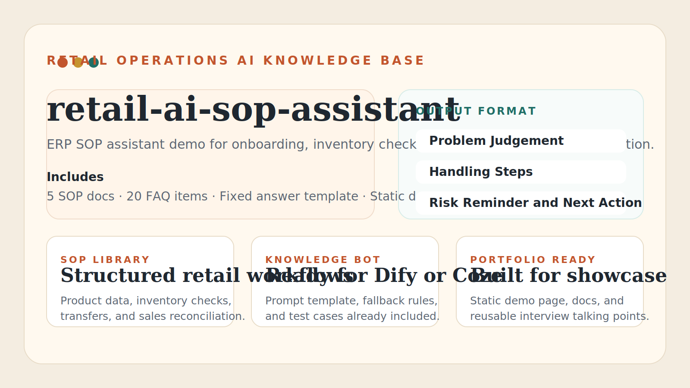

# retail-ai-sop-assistant



一个面向零售业务新人、商品助理、门店运营支持的 AI 知识库项目。  
项目目标是把常见 ERP 操作、库存排查、调拨处理、销售数据核对等流程整理成结构化 SOP，并接入 Dify、Coze 或其他知识库平台，做成可问答的内部业务助手。

## 0. 一页看懂这个项目
- 项目定位：零售业务新人培训 + ERP 操作 SOP 知识库 Demo
- 适合平台：Dify、Coze、其他支持知识库问答的平台
- 已完成内容：SOP 文档、FAQ、提示词模板、测试问题集、静态演示页
- 适合用途：GitHub 作品集、简历项目、录屏演示、知识库原型

## 1. 项目适合解决什么问题
- 新员工不知道 ERP 流程从哪里开始
- 门店库存异常时不知道先查什么
- 调拨单、商品资料、销售数据出现差异时缺少统一处理步骤
- 业务知识分散在聊天记录和口头经验里，难以复用

## 2. 目录结构

```text
retail-ai-sop-assistant
├── assets/
│   └── project-cover.svg
├── .gitignore
├── 01_商品资料维护SOP.md
├── 02_库存异常排查SOP.md
├── 03_调拨单处理SOP.md
├── 04_销售数据核对SOP.md
├── 05_ERP操作风险清单.md
├── 06_新员工常见问题FAQ.md
├── 07_知识库系统提示词模板.md
├── 08_知识库测试问题集.md
├── 09_项目演示讲解稿.md
├── app.js
├── index.html
├── styles.css
└── README.md
```

## 3. 当前版本包含什么
- 5 篇通用零售业务 SOP 文档
- 1 份新员工常见问题 FAQ，内含 20 个高频问答
- 1 套可直接配置到 Dify/Coze 的回答模板
- 1 份可直接粘贴到平台的系统提示词模板
- 1 份用于演示和验收的测试问题集
- 1 份可直接用于面试和录屏的项目讲解稿
- 1 个静态演示页，可直接打开做项目展示

## 4. 本地演示方式
如果你想先把项目作为作品展示出来，可以直接打开 [index.html](/Users/guanchengbin/retail-ai-sop-assistant/index.html)。

也可以在终端里进入项目目录后执行：

```bash
open index.html
```

这个页面不依赖后端，主要用于展示：
- 项目定位
- 已整理的文档范围
- AI 助手的固定回答格式
- 几个典型业务问题的回答示例

## 5. 推荐知识库问答输出模板
把下面这段作为系统提示词或机器人回复模板的核心约束：

```text
你是零售业务 AI 知识库助手，服务对象是零售公司新人、商品助理、门店运营支持人员。

你的回答必须基于已上传的 SOP 和 FAQ 文档，优先给出可执行、可检查、可追溯的建议。
如果知识库没有足够信息，请明确说明“当前资料不足，需要补充业务背景或单据明细”，不要编造公司制度。

每次回答必须固定输出以下 5 个模块，并使用中文：

问题判断：
处理步骤：
需要确认的信息：
风险提醒：
建议后续动作：

要求：
1. 处理步骤尽量按顺序列出，便于新员工照着执行。
2. 风险提醒要突出“不要直接调账、不要跳过审核、不要凭口头确认”等关键控制点。
3. 如果问题涉及调拨、库存、价格、主数据、报表，请提醒用户核对单据状态、时间范围和统计口径。
4. 如果问题超出知识库范围，明确指出需要联系的角色，例如商品负责人、门店店长、系统支持或财务。
```

## 6. Dify / Coze / 其他平台的搭建建议

### 方案一：Dify
1. 创建一个新的知识库应用或聊天助手。
2. 上传本项目中的 6 个 Markdown 文件。
3. 分段建议使用“按标题切分”或“500-800 字符分段，保留少量重叠”。
4. 在系统提示词中加入上面的固定输出模板。
5. 测试 10 个典型问题，观察是否能正确引用 SOP 内容。

### 方案二：Coze
1. 创建一个新 Bot。
2. 导入本项目文档到知识库。
3. 将 Bot 的人设设为“零售业务 SOP 助手”。
4. 在回复要求中强制固定输出 5 个模块。
5. 增加兜底规则：资料不足时先补充背景，不直接下结论。

### 方案三：其他 AI 平台
只要支持“知识库上传 + 系统提示词 + 对话测试”的平台，都可以复用这套内容。  
关键不是平台本身，而是：
- 文档要结构清晰
- 提示词要限制回答格式
- 测试问题要覆盖真实业务场景

## 7. 推荐先用的两个辅助文件
- [07_知识库系统提示词模板.md](/Users/guanchengbin/retail-ai-sop-assistant/07_知识库系统提示词模板.md)：适合直接复制到 Dify / Coze 的系统提示词。
- [08_知识库测试问题集.md](/Users/guanchengbin/retail-ai-sop-assistant/08_知识库测试问题集.md)：适合做知识库上线前验收、录屏演示和作品集展示。
- [09_项目演示讲解稿.md](/Users/guanchengbin/retail-ai-sop-assistant/09_项目演示讲解稿.md)：适合做面试讲解、口头介绍和项目录屏脚本。

## 8. 建议优先测试的 10 个问题
- 调拨单数据不一致怎么办？
- 门店库存异常要先查哪些信息？
- 商品资料维护前要检查什么？
- 销售数据和库存数据对不上怎么排查？
- 新员工做 ERP 操作时有哪些注意事项？
- 负库存先查什么？
- 门店说系统有库存但卖不了怎么办？
- 为什么不能直接调账？
- 在途库存一直不消失怎么处理？
- 价格维护最容易出什么错？

## 9. 你可以怎样把它写进简历
可以写成下面这种项目描述：

```text
零售业务 AI 知识库 / ERP 操作 SOP 助手
- 基于通用零售业务流程，整理商品资料维护、库存异常排查、调拨处理、销售数据核对等 SOP 文档，沉淀 20 个新员工高频 FAQ。
- 使用 Dify / Coze 搭建知识库问答助手，支持 ERP 操作咨询、库存异常排查、调拨处理建议等场景。
- 设计统一回答模板，固定输出“问题判断、处理步骤、需要确认的信息、风险提醒、建议后续动作”，提升知识复用效率和答复一致性。
```

## 10. 后续可扩展方向
- 增加门店补货流程 SOP
- 增加采购收货异常 SOP
- 增加盘点作业 SOP
- 增加角色权限说明
- 接入企业微信、飞书或网页聊天界面
- 增加问题分类标签和命中测试集

## 11. GitHub 发布建议
- 仓库名继续使用 `retail-ai-sop-assistant` 就可以。
- 主页展示优先放静态页截图、知识库配置截图和 2-3 个典型问答结果。
- 仓库描述可以写：`Retail ERP SOP knowledge base demo for onboarding and operations support.`
- 如果后面发布到 GitHub Pages，可以直接用当前静态页作为项目首页。

## 12. 使用建议
- 这套资料适合作为模拟项目、作品集项目、简历项目或知识库原型。
- 内容为通用零售业务写法，不涉及真实公司内部制度。
- 如果后面你想把它做成更完整的演示项目，可以继续加对话截图、测试样例、部署说明和真实知识库链接。
